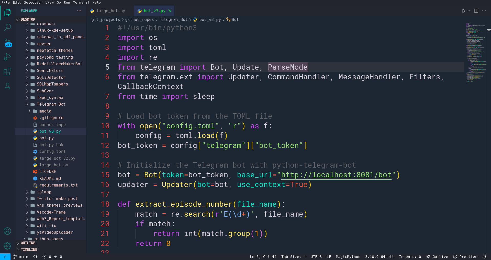
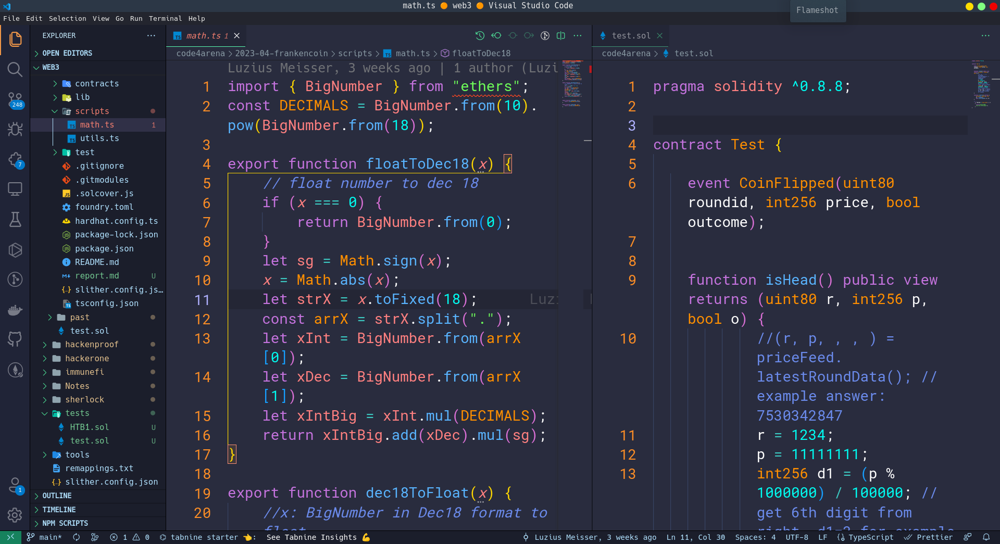

# 🎨 Custom VS Code Themes 🎨

This repository contains a collection of custom VS Code themes created by me. Each theme has been designed with a specific purpose in mind, and I've tried to create a consistent look and feel across all of them.

# 🌈 Available Themes 🌈

Here's a list of the themes that are currently available in this repository:

- 🌊 [Andromeda tweaked](Andromeda-tweaked/andromeda-tweaked)
  
- 🌅 [Material tweaked](Material-Tweaked/material-tweaked)
  

Each theme comes with a screenshot to give you an idea of what it looks like in action.

# 📥 Installation 📥

To install a theme, follow these steps:

1. Search vscode market place

- [Andromeda-tweaked](https://marketplace.visualstudio.com/items?itemName=aviksaikat.andromeda-tweaked)
- [Material-tweaked](https://marketplace.visualstudio.com/items?itemName=aviksaikat.material-tweaked)

2. Open vscode, type `Ctrl+p`, then type

```bash
# Andromeda-tweaked
ext install aviksaikat.material-tweaked
# Material-tweaked
ext install aviksaikat.material-tweaked
```

# 🙌 Contributing 🙌

If you have a custom VS Code theme that you'd like to contribute to this repository, please feel free to submit a pull request! Before you do, please make sure your theme meets the following criteria:

- It has a unique name.
- It includes a screenshot.
- It follows a consistent naming convention (i.e. `theme-name-color-theme.json`).

Thank you for your contribution! Let's make the VS Code community even better. 🚀
